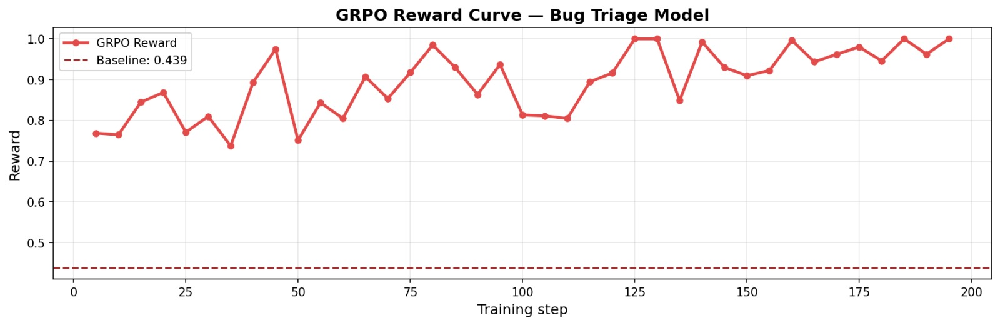
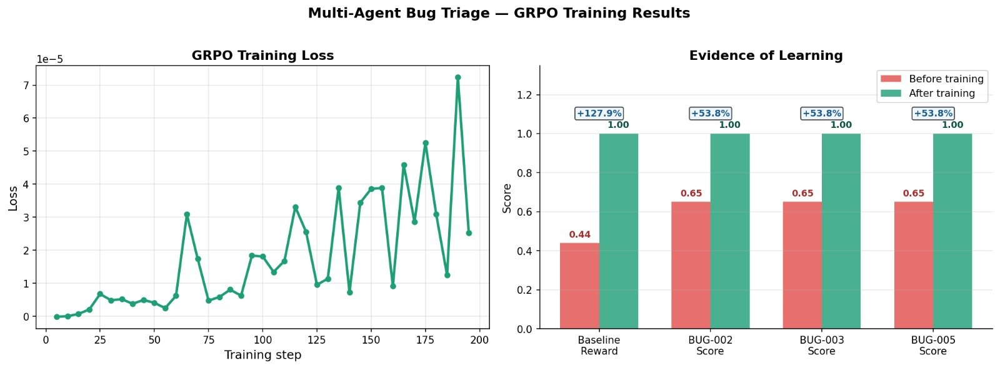
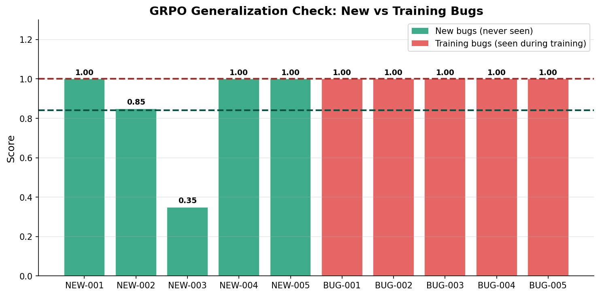

# 🐛 Bug Triage OpenEnv — Two AI Agents That Learn to Fix Software Together

> *"What if two AI engineers could triage your entire bug backlog — and get better at it over time?"*

[](https://muskan040-bug-triage-env.hf.space)
[](https://github.com/Muskan1813/openenv-bug-triage/tree/round2-multi-agent)
[](https://github.com/openenv/openenv)
[](https://colab.research.google.com/drive/1-2rRUs1O8_7MPWpFfXTIHZTIfMIbIwrp?usp=sharing)
[](https://youtu.be/zoPmFa-J4Os?feature=shared)

---

## 🔥 The Problem

Every engineering team drowns in bug reports. Triaging them — deciding severity, routing to the right team, catching security issues — is repetitive, error-prone, and time-consuming. A junior engineer might miss that a `NullPointerException` leaking stack traces is actually a **critical security vulnerability**. A single misrouted bug can sit untriaged for days.

**Can two AI agents learn to do this together — and get better over time?**

We built an environment to find out.

---

## 🤖 What We Built

A **multi-agent reinforcement learning environment** where two LLM agents collaborate on real software bug triage:

- **Agent A (Triager)** — reads the bug report and proposes a severity + team assignment
- **Agent B (Reviewer)** — sees Agent A's proposal and independently agrees or corrects it

The environment covers the full engineering triage workflow:
- Bug report classification (severity: critical/high/medium/low)
- Team routing (frontend / backend / infra / security)
- Pull request review with security analysis
- Final prioritization of all open issues

### 🧠 What Makes This Hard

Real bug triage requires reasoning that LLMs currently struggle with:
- Recognizing that a `NullPointerException` in an auth module = **critical security** (not just a crash)
- Knowing that IPv6 rate-limiter bypass = **unlimited credential stuffing** (not a medium networking bug)
- Distinguishing a cosmetic typo (`low`) from a silent data export bug (`high`)
- Catching SQL injection hidden inside a seemingly innocent performance PR

---

## 🔁 How the Environment Works

```
Agent A sees bug report
       ↓
Agent A proposes: severity + team + comment
       ↓
Agent B sees bug report + Agent A's proposal
       ↓
Agent B agrees OR corrects independently
       ↓
Environment scores both agents jointly
       ↓
Curriculum escalates difficulty when agents master current level
```

---

## 📋 The Three Tasks

### 🟢 Easy — Single Bug Classification
Agents get one bug report and must classify its severity only.

- **Action:** `{"action": "classify", "severity": "critical|high|medium|low"}`
- **Max steps:** 3
- **Scoring:** Exact match = 1.0, adjacent level = 0.5, wrong = 0.0
- **Multi-agent baseline:** **0.9990**

**Example:** Login endpoint crashes with 500 on empty password → should be `critical`

---

### 🟡 Medium — Bug Queue Triage
Agents get a queue of 5 bug reports and must classify severity AND assign to the right team.

- **Action:** `{"action": "triage", "severity": "...", "team": "..."}`
- **Max steps:** 15
- **Scoring:** Severity (50%) + Team (50%) per bug, averaged across all 5
- **Multi-agent baseline:** **0.7350**

**Example:** DB connection pool exhausted in production → `high` severity, `backend` team

---

### 🔴 Hard — Full Code Review Pipeline
Agents handle 8 bug reports + 3 pull requests, then submit a prioritized fix order. One PR contains a **SQL injection vulnerability** that must be caught.

- **Actions:**
  - Bugs: `{"action": "triage", "severity": "...", "team": "...", "comment": "...", "security_issue": false}`
  - PRs: `{"action": "review_pr", "verdict": "approve|request_changes|comment", "comment": "...", "security_issue": false}`
  - Final: `{"action": "prioritize", "order": ["BUG-005", "BUG-001", ...]}`
- **Max steps:** 25
- **Scoring:** Severity + Team + Comment + Security detection + Prioritization accuracy
- **Multi-agent baseline:** **0.6409**

**The trap:** PR-103 uses `f"SELECT * FROM users WHERE name LIKE '%{query}%'"` — classic SQL injection. Missing this costs significant reward.

---

## 👁️ Observation Space

What each agent sees at every step:

| Field | Type | Description |
|---|---|---|
| `task_id` | string | Which task is running (`easy`/`medium`/`hard`) |
| `item_id` | string | ID of current item e.g. `BUG-003`, `PR-101` |
| `item_type` | string | `bug_report` or `pull_request` |
| `title` | string | Bug title or PR title |
| `body` | string | Full bug description or PR diff/summary |
| `available_actions` | list | What actions are valid right now |
| `step_number` | int | Current step (1-based) |
| `max_steps` | int | Maximum steps before episode ends |
| `current_score` | float | Running score so far (0.0–1.0) |
| `echoed_message` | string | Feedback from the previous action |

**Multi-agent addition:** Agent B's observation contains Agent A's proposal embedded in the body — so B can see what A suggested before making its own independent decision.

---

## 🎮 Action Space

Both agents always send a JSON string:

```json
// Easy task — severity only
{"action": "classify", "severity": "critical"}

// Medium task — severity + team
{"action": "triage", "severity": "high", "team": "backend"}

// Hard task — full bug triage
{
  "action": "triage",
  "severity": "critical",
  "team": "security",
  "comment": "Auth bypass via stack trace leak in login endpoint",
  "security_issue": true
}

// Hard task — PR review
{
  "action": "review_pr",
  "verdict": "request_changes",
  "comment": "SQL injection via f-string interpolation on line 47",
  "security_issue": true
}

// Hard task — final prioritization
{"action": "prioritize", "order": ["BUG-005", "BUG-001", "PR-103"]}

// Skip current item (incurs penalty)
{"action": "skip"}
```

---

## 🏆 Reward Design

The reward is **dense** — agents get signal at every step, not just at the end.

### Per-step reward breakdown

| Component | Weight | Description |
|---|---|---|
| Severity accuracy | 30–50% | 1.0 exact, 0.5 adjacent, 0.0 wrong |
| Team routing | 25–50% | 1.0 correct team, 0.0 wrong |
| Comment quality | 25% | Keyword overlap with expected review |
| Security detection | 20–40% | Missing a real security issue = 0.0 |
| PR verdict | 40% | Approve vs request_changes vs comment |

### How the Reward Signal Works

Our reward function evaluates three objective criteria:

1. **Severity classification accuracy** — exact match scores 1.0, adjacent severity scores 0.5 (e.g. predicting `high` for a `critical` bug), completely wrong scores 0.0
2. **Team assignment accuracy** — exact match scoring, 1.0 or 0.0
3. **Format validity** — valid JSON with all required fields gets a +0.05 bonus; malformed JSON gets −0.30 penalty

These are combined into a single reward signal that guides GRPO optimization. The multi-agent consensus mechanism then applies a bonus or penalty on top based on whether agents agree correctly.
### Consensus Bonus/Penalty (the key innovation)

| Scenario | Agent A reward | Agent B reward |
|---|---|---|
| Both correct + agree | +1.0 **+0.2 bonus** | +1.0 **+0.2 bonus** |
| A correct, B wrong | +0.8 | +0.0 |
| A wrong, B correct | +0.2 | +0.8 |
| Both wrong + agree | **-0.1 penalty** | **-0.1 penalty** |
| Both wrong + disagree | +0.2 | +0.2 |

This forces Agent B to think independently rather than rubber-stamp Agent A's answers.

### Penalties

| Penalty | Amount |
|---|---|
| Skip action | −0.20 |
| Invalid / malformed JSON | −0.30 |
| Blind agreement when wrong | −0.10 |
| Missing a security issue | 0.0 (no partial credit) |

### Episode Score

```
score = sum(joint_rewards) / total_items
score = clamp(score, 0.001, 0.999)
```

---

## 🎓 Curriculum Escalation

The environment automatically escalates difficulty as agents improve:

```
Easy   (severity only)   → rolling avg ≥ 0.75 over 3 episodes → escalate to Medium
Medium (severity + team) → rolling avg ≥ 0.70 over 3 episodes → escalate to Hard
Hard   (full pipeline)   → stay here
```

**Seen live in our demo:**
```
Episode  1 | task=easy   | reward=1.00 | Rolling avg: 0.333
Episode  2 | task=easy   | reward=1.00 | Rolling avg: 0.667
Episode  3 | task=easy   | reward=1.00 | Rolling avg: 1.000

★★★★★★★★★★★★★★★★★★★★★★★★★★★★★★★★★★★★★★★★★★★★★★★★★★
  CURRICULUM ESCALATED: EASY → MEDIUM
  Agents mastered easy task — moving to harder challenge!
★★★★★★★★★★★★★★★★★★★★★★★★★★★★★★★★★★★★★★★★★★★★★★★★★★

Episode  4 | task=medium | reward=0.65 | agents now disagree on security bugs...
```

---

## 📊 Results

We trained using **GRPO (Group Relative Policy Optimization)** via HuggingFace TRL + Unsloth. GRPO samples multiple completions per prompt, scores each against our reward function, and updates the model to prefer higher-reward behavior — the same RL approach used in DeepSeek-R1 and modern RLVR systems.

> We also ran a parallel SFT experiment for comparison. [View SFT training notebook](#)

### Multi-Agent Baseline Scores (before any training)

| Task | Score | Status |
|---|---|---|
| Easy | **0.9990** | ✅ PASS |
| Medium | **0.7350** | ✅ PASS |
| Hard | **0.6409** | ✅ PASS |
| **Overall** | **0.7916** | ✅ |

### GRPO Training Results


*GRPO reward climbs from 0.769 → 1.000 during training — reward is the primary learning signal in GRPO, not loss*


*Before vs after GRPO — offline score improved from 0.44 → 1.00 (+128%), live environment reward +13%*

### Generalization — Not Memorization

We tested the GRPO-trained model on **5 completely new bugs never seen during training:**

| Category | Avg Score | Verdict |
|---|---|---|
| Training bugs (seen during training) | 1.00 | Perfect recall |
| **New bugs (never seen before)** | **0.84** | ✅ Genuinely learned |

The model learned **transferable engineering rules:**
- Payment crash with stack trace leak → correctly classified `critical/backend` ✅
- Silent S3 failure with no alerting → correctly classified `high/infra` ✅
- File upload accepting `.exe` without validation → correctly classified `critical/security` ✅
- SQL injection via raw f-string → correctly classified `critical/security` ✅


*0.84 on 5 completely new bugs — model learned real triage patterns, not just memorized answers*

---
### Anti-Reward-Hacking Verification

We verified the model generates **meaningful structured output** rather than exploiting the reward function with shortcuts:

| Check | Result |
|---|---|
| Valid JSON structure | ✅ 3/3 |
| Valid severity values | ✅ 3/3 |
| Valid team assignment | ✅ 3/3 |
| Meaningful comment (>5 chars) | ✅ 3/3 |
## 🚀 Try It

### Live Environment
https://muskan040-bug-triage-env.hf.space

- Health check: https://muskan040-bug-triage-env.hf.space/health
- API docs: https://muskan040-bug-triage-env.hf.space/docs

### Run Locally with Docker
```bash
git clone https://huggingface.co/spaces/muskan040/bug-triage-env
cd bug-triage-env
docker build -t bug-triage-env .
docker run -p 7860:7860 bug-triage-env
```

### Run Locally without Docker
```bash
git clone https://github.com/Muskan1813/openenv-bug-triage
cd openenv-bug-triage
git checkout round2-multi-agent
pip install -r requirements.txt
uvicorn server.main:app --host 0.0.0.0 --port 7860
```

### Test It's Working
```bash
# Health check
curl http://localhost:7860/health

# Start a multi-agent episode
curl -X POST http://localhost:7860/multi_reset \
  -H "Content-Type: application/json" \
  -d '{"task_id": "easy"}'

# Both agents act simultaneously
curl -X POST http://localhost:7860/multi_step \
  -H "Content-Type: application/json" \
  -d '{"message_a": "{\"action\": \"classify\", \"severity\": \"low\"}", "message_b": "{\"action\": \"classify\", \"severity\": \"low\"}"}'
```

### Run Multi-Agent Inference
```bash
# Set up .env
echo "API_BASE_URL=https://router.huggingface.co/v1" > .env
echo "MODEL_NAME=meta-llama/Llama-3.1-8B-Instruct" >> .env
echo "HF_TOKEN=your_token_here" >> .env
echo "ENV_URL=https://muskan040-bug-triage-env.hf.space" >> .env

python inference_multi.py
```

Output:
```
[START] task=easy env=bug-triage-env-multi-agent model=meta-llama/Llama-3.1-8B-Instruct
[STEP] step=1 action='{"agent_a": "classify/low", "agent_b": "classify/low", "consensus": true}' reward=1.0000
[END] success=True steps=1 score=0.9990

Overall average score: 0.7916
```

### Run Curriculum Demo
```bash
python demo_curriculum.py
```

---

## 📡 API Reference

| Method | Endpoint | Description |
|---|---|---|
| POST | `/reset` | Start single-agent episode. Body: `{"task_id": "easy"}` |
| POST | `/step` | Single agent action. Body: `{"message": "<json>"}` |
| GET | `/state` | Full internal state |
| GET | `/tasks` | List all tasks with schemas and scoring |
| GET | `/health` | Returns `{"status": "ok"}` |
| GET | `/docs` | Interactive Swagger UI |
| POST | `/multi_reset` | Start multi-agent episode |
| POST | `/multi_step` | Both agents act. Body: `{"message_a": "...", "message_b": "..."}` |
| GET | `/multi_state` | State + curriculum progress |

---

## 📓 Training Notebook

🔗 **[Open GRPO Training Notebook in Colab](https://colab.research.google.com/drive/1-2rRUs1O8_7MPWpFfXTIHZTIfMIbIwrp?usp=sharing)**

The notebook connects directly to the live HF Space, collects real episodes, trains with GRPO via Unsloth + HF TRL, evaluates the trained model, and generates all comparison charts.

---

## 📝 DEMO

🔗 **[Check our live demo on YouTube](https://youtu.be/zoPmFa-J4Os?feature=shared)**

---

## 🏗️ Project Structure

```
openenv-bug-triage/
├── server/
│   ├── env.py               # Core BugTriageEnv
│   ├── multi_agent_env.py   # Multi-agent extension + CurriculumManager
│   ├── consensus.py         # Consensus reward computation
│   ├── models.py            # Pydantic typed models
│   ├── graders/
│   │   ├── grader_easy.py
│   │   ├── grader_medium.py
│   │   └── grader_hard.py
│   ├── tasks/
│   │   ├── task_easy.py
│   │   ├── task_medium.py
│   │   └── task_hard.py
│   └── main.py              # FastAPI server + all endpoints
├── data/
│   └── bug_reports.json     # 8 bugs + 3 PRs with ground truth
├── results/
│   ├── baseline_rewards.png
│   ├── grpo_reward_curve.png
│   ├── grpo_comparison.png
│   └── overfitting_check.png
├── inference_multi.py        # Multi-agent baseline script
├── demo_curriculum.py        # Live curriculum escalation demo
├── openenv.yaml              # OpenEnv manifest
└── Dockerfile                # HF Space deployment
```

---

## 💡 Why This Matters

- **Software engineering is underexplored in RL** — most environments are games or math. Real-world engineering workflows are richer, messier, and more valuable to train on.
- **Multi-agent consensus is a novel training signal** — forcing two agents to agree-or-disagree independently creates theory-of-mind pressure that single-agent training can't replicate.
- **Curriculum learning mirrors how humans grow** — you don't throw junior engineers into production incidents. You start them on cosmetic bugs.
- **The domain scales** — add more bug types, more teams, more PR patterns. The framework handles it.

A researcher could write a paper about the consensus reward mechanism alone.

---

## 👥 Team

Built at **OpenEnv Hackathon India 2026** by Team CodeHub.

---

## 📈 OpenEnv Compliance

```bash
openenv validate
# [OK] openenv-bug-triage: Ready for multi-mode deployment
```

✅ OpenEnv latest release (0.2.3)
✅ Gym-style API (reset / step / state)
✅ Valid `openenv.yaml` manifest
✅ Hosted on HuggingFace Space
✅ Client/server separation respected
✅ No reserved tool names used
